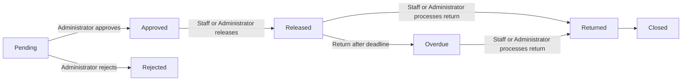
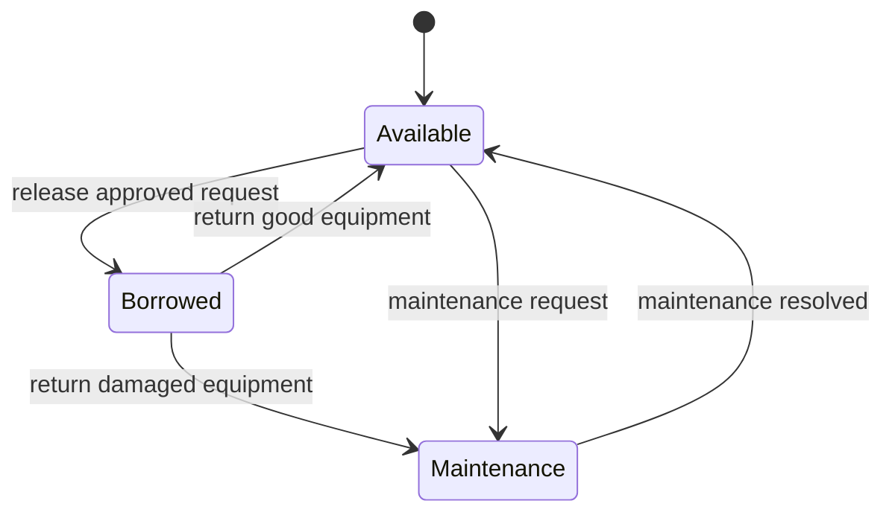

# AssetFlow — Systems Analysis and Design Lab 4

## 3. Updated ERD and Use Case Diagram

### Entity Relationship Diagram

### Use Case Diagram

## 4. Role-Permission Matrix

| Permission | Administrator | Laboratory Staff | Requester |
|---|:---:|:---:|:---:|
| View equipment | Yes | Yes | Yes |
| Create borrowing transactions | Yes | Yes | Yes |
| Process returns | Yes | Yes | No |
| Submit maintenance requests | Yes | Yes | No |
| Update permitted workflow records | Yes | Yes | No |
| Manage users and equipment | Yes | No | No |
| Approve or reject requests | Yes | No | No |
| Manage maintenance status | Yes | No | No |
| View reports and audit logs | Yes | No | No |

Laboratory Staff can update only permitted borrowing workflow records through the controlled release and return RPCs. Direct table updates are not granted.

## 5. Workflow Diagram

Equipment follows these status rules:

## 6. Business Rules

| ID | Rule |
|---|---|
| BR-01 | Only authenticated users can access the application. |
| BR-02 | Every authenticated user must have one `profiles` row and one application role. |
| BR-03 | Only available equipment can be requested or released. |
| BR-04 | A borrowing request must have a purpose, start time, and expected return time after the start time. |
| BR-05 | Only Administrators can approve or reject borrowing requests. |
| BR-06 | An Administrator cannot approve or reject their own request. |
| BR-07 | Only Laboratory Staff or Administrators can release equipment or process returns. |
| BR-08 | Returning damaged equipment changes its status to `Maintenance`; otherwise it becomes `Available`. |
| BR-09 | Maintenance requests require an equipment item and a non-empty description. |
| BR-10 | Only Administrators can change user roles, equipment records, and maintenance status. |
| BR-11 | Restricted operations are implemented through security-definer RPCs and role checks. |
| BR-12 | Important create and workflow actions write an entry to `audit_logs`. |
| BR-13 | Row Level Security limits profiles, borrowing requests, maintenance requests, and audit logs by role and ownership. |

## 7. Audit-Log Screenshot

## 8. Functional Test Results

| Test ID | Scenario | Expected result | Result |
|---|---|---|---|
| TC-01 | Login with valid account | User enters the system and receives the correct role navigation | Pass |
| TC-02 | Login with invalid password | Login is rejected with an error message | Pass |
| TC-03 | Staff views equipment | Equipment list and statuses are visible | Pass |
| TC-04 | Staff creates borrowing transaction | Request is saved as `Pending` | Pass |
| TC-05 | Administrator approves pending request | Request changes to `Approved` and audit entry is created | Pass |
| TC-06 | Staff releases approved request | Request changes to `Released`; equipment becomes `Borrowed` | Pass |
| TC-07 | Staff processes return | Request changes to `Returned`; equipment becomes `Available` or `Maintenance` | Pass |
| TC-08 | Staff submits maintenance request | Maintenance record is created with `Pending` status | Pass |
| TC-09 | Administrator changes maintenance status | Status updates and resolved equipment becomes `Available` | Pass |
| TC-10 | Unauthorized role opens admin action | RPC rejects the operation | Pass |
| TC-11 | Administrator views audit logs | Audit records display with user, module, action, and timestamp | Pass |

