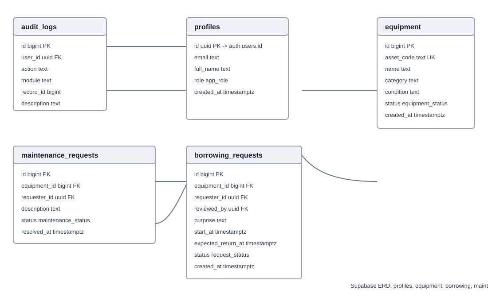
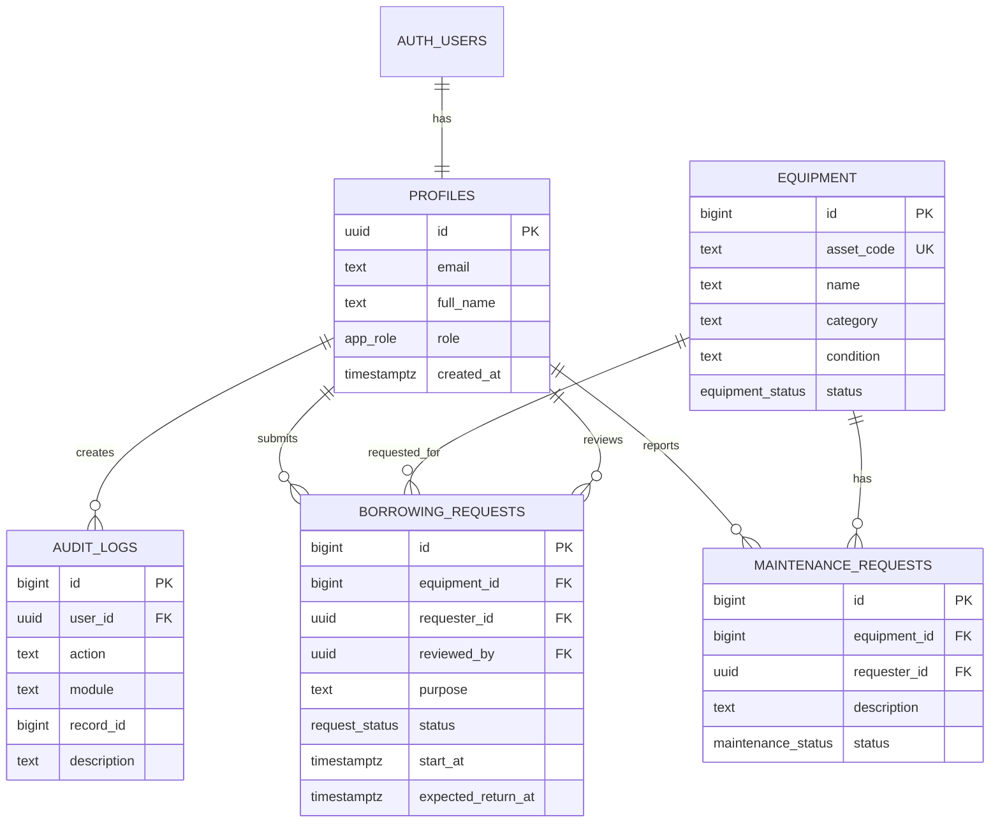
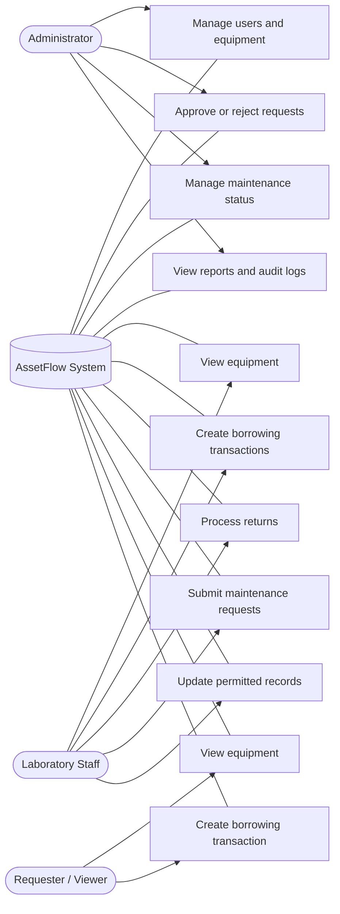

# Lab 4 requirement coverage
Based on the uploaded Laboratory 4 Section A handout: roles, Pending/Approved/Rejected/Released/Returned/Overdue/Closed workflow, BR-A4-01..10, audit_logs, adaptive navigation, and TC-A4-01..10.

## Updated ERD

The official ERD for this project is the Supabase-generated database diagram shown in the submitted screenshot. It contains the following tables: `profiles`, `equipment`, `borrowing_requests`, `maintenance_requests`, and `audit_logs`. The `profiles.id` field references `auth.users.id`.

### ERD Relationship Reference

| Relationship | Description |
|---|---|
| `auth.users.id` → `profiles.id` | Each authenticated user has one application profile. |
| `profiles.id` → `borrowing_requests.requester_id` | A profile can create borrowing requests. |
| `profiles.id` → `borrowing_requests.reviewed_by` | An administrator can review borrowing requests. |
| `profiles.id` → `maintenance_requests.requester_id` | A profile can submit maintenance requests. |
| `profiles.id` → `audit_logs.user_id` | Actions are recorded against the user who performed them. |
| `equipment.id` → `borrowing_requests.equipment_id` | Each borrowing request is for one equipment item. |
| `equipment.id` → `maintenance_requests.equipment_id` | Each maintenance request belongs to one equipment item. |

> **Submitted ERD image:** The ERD image below is the visual documentation of the Supabase schema shown in the submitted database diagram.

The Mermaid diagram below is the readable documentation version of the same schema.

# Use Case Diagram

# Role matrix
| Function | Admin | Laboratory Staff | Requester |
|---|---|---|---|
| Manage users/equipment | ✓ | — | — |
| View equipment | ✓ | ✓ | ✓ |
| Create borrowing transactions | ✓ | ✓ | ✓ |
| Approve/reject requests | ✓ | — | — |
| Process returns | ✓ | ✓ | — |
| Submit maintenance requests | ✓ | ✓ | — |
| Update permitted workflow records | ✓ | ✓ | — |
| Manage maintenance status | ✓ | — | — |
| View reports/audit logs | ✓ | — | — |

# Workflow
Pending → Approved/Rejected → Released → Returned → Closed; Overdue may occur after release.
